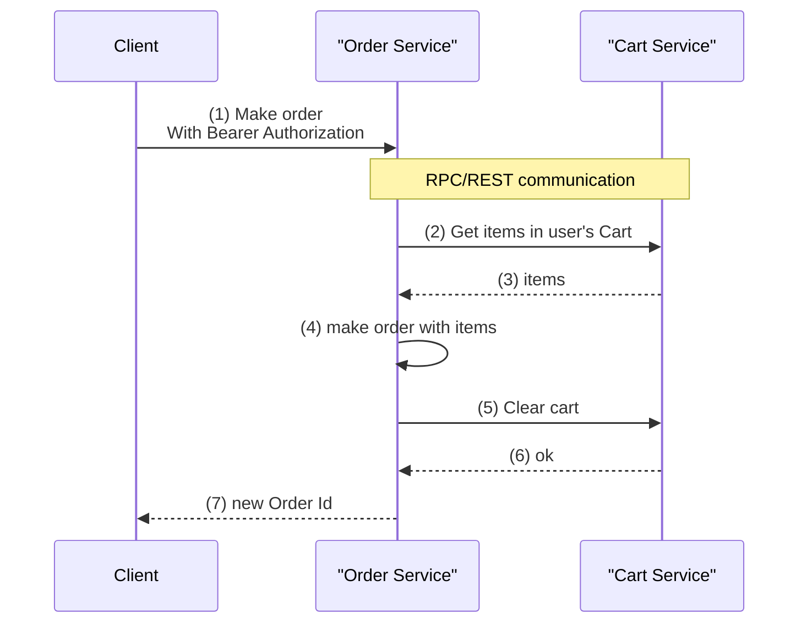

```mermaid
sequenceDiagram
    participant Client
    participant OrderService as "Order Service"
    participant CartService as "Cart Service"

    Client->>OrderService: (1) Make order<br/>With Bearer Authorization
    Note over OrderService,CartService: RPC/REST communication
    OrderService->>CartService: (2) Get items in user's Cart
    CartService-->>OrderService: (3) items
    OrderService->>OrderService: (4) make order with items
    OrderService->>CartService: (5) Clear cart
    CartService-->>OrderService: (6) ok
    OrderService-->>Client: (7) new Order Id
```